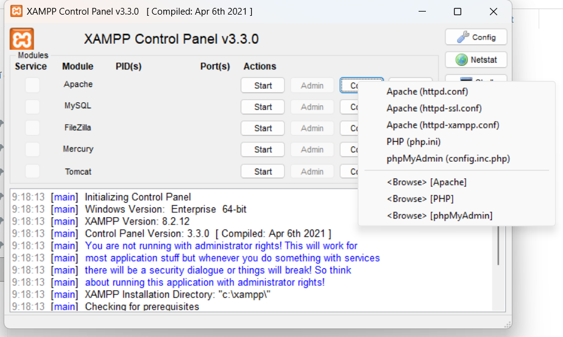
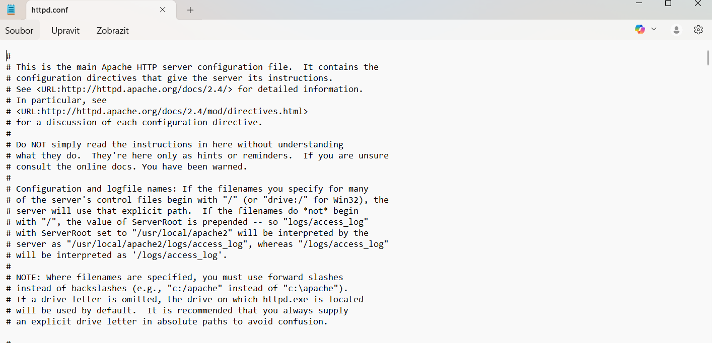
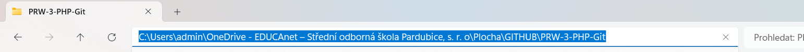
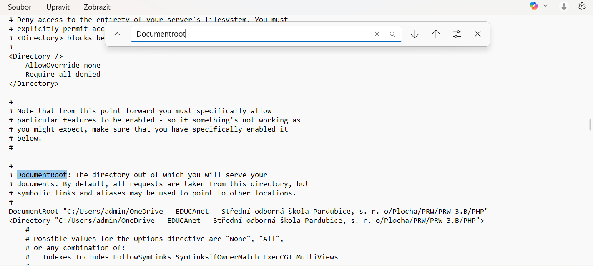
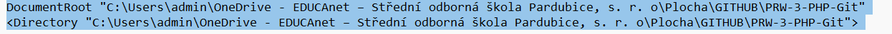
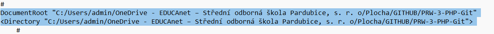

# Lekce 0 – Nastavení prostředí, DocumentRoot a spuštění localhostu

## 🎯 Cíl lekce
Cílem této lekce je:

- správně nastavit `DocumentRoot` v XAMPPu,
- pracovat s vlastní složkou pro projekty (např. GIT repozitář),
- spouštět projekty na adrese `http://localhost/`,
- pochopit, jak funguje Apache konfigurace,
- kontrolovat běh serveru pomocí XAMPP Control Panelu.

---

## 🟧 1. Zapnutí Apache a MySQL v XAMPP

Otevřete **XAMPP Control Panel** a spusťte:

- **Apache**
- **MySQL**

Oba moduly musí být **zelené**, ve stavu *Running*.

📸 *Ukázka Cloud Panelu (1.png):*



---

## 🟩 2. Otevření konfigurace Apache (`httpd.conf`)

Klikněte na:

```

Apache → Config → Apache (httpd.conf)

```

📸 *Menu Config (2.png):*



---

## 🟦 3. Otevření souboru httpd.conf

Po kliknutí na „Apache (httpd.conf)“ se otevře konfigurační soubor Apache.

📸 *Ukázka (3.png):*



---

## 🟥 4. Vyhledání položky DocumentRoot

V souboru použijte klávesovou zkratku:

```

Ctrl + F → DocumentRoot

```

📸 *Vyhledání v konfiguraci (4.png):*



---

## 🟦 5. Úprava DocumentRoot

### ❗ Proč je to důležité?
Windows používá `\` (zpětná lomítka), ale **Apache musí mít `/` (klasické lomítko)**.

Tato cesta **nefunguje**:

```

C:\Users\admin\OneDrive...\PRW-3-PHP-Git

```

Správná cesta:

```

C:/Users/admin/OneDrive/.../PRW-3-PHP-Git

```

📸 *Původní verze (5.png):*



📸 *Opravená verze se správnými lomítky (6.png):*



Po úpravě nezapomeňte **restartovat Apache**.

---

## 🟨 6. Kontrola správného nastavení – localhost

Po restartu Apache otevřete v prohlížeči:

```

[http://localhost/](http://localhost/)

```

Pokud vše funguje, uvidíte výpis složek z vašeho DocumentRoot.

📸 *Ukázka funkčního localhostu (8.png):*


- zobrazit projekt na `http://localhost/`.
